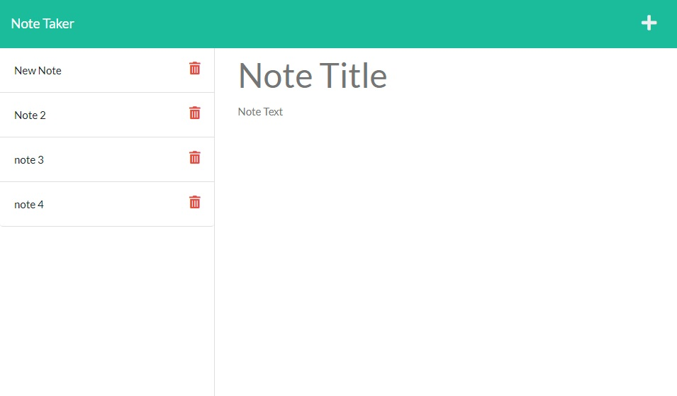

# Note Taker Application

## Description:

---
This is a Note Taking application which you can save notes with a Titles and associated text.

---

## Table of Contents:

---
1. [Installation Instructions](#installation-instructions)
2. [Usage](#usage)
3. [Test Instructions](#test-instructions)
4. [Contribute](#contribute)
5. [Licenses](#licenses)
6. [Questions](#questions)

## Installation Instructions:

---
1. Install `node.js`
2. Clone the `notetaker-fm` repository.
3. From the CLI, `npm install`

## Usage:

---
If installed locally using node.js:

1. In the CLI enter, `node index.js`
2. Then follow the Prompts.

#### The application is also available at:
[Note Taker](https://notetaker-fm.herokuapp.com/)
---

## Test Instructions:

---
No tests are currently available.

## Contribute:

---
- To contribute, contact me through Github or Email.

## Licenses:

---

**MIT License**
Copyright &#169; <YEAR> <NAME>

## Questions:

---

### What is your Github username?

[Myuze](https://github.com/Myuze)

### If you have any other questions, you can reach me at:

[flmeneses.dev@gmail.com](mailto:flmeneses.dev@gmail.com)
